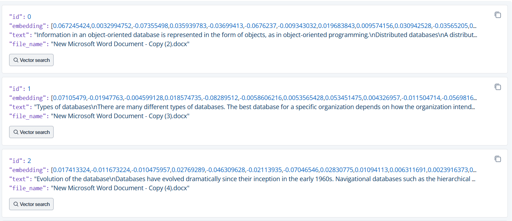

# Document Processing and Embedding

This project involves extracting text from documents, generating embeddings, and interacting with a Milvus vector database for search and response generation.

## Overview

- **Text Extraction**: Extract text from DOCX, PDF, and PPTX files.
- **Embedding Generation**: Generate embeddings using the `SentenceTransformer` model.
- **Milvus Integration**: Connect to Milvus, set up collections, insert embeddings, and perform document searches.
- **Search and Response**: Query the database, retrieve documents, and generate responses based on retrieved data.

## Images




## Scripts

### `text_extraction.py`

This module provides functions to extract text from various file formats such as DOCX, PDF, and PPTX.

- **Functions**:
  - `extract_text_from_file(file_path)`: Extracts text from a file based on its extension.
  - `extract_text_from_docx(file_path)`: Extracts text from a DOCX file.
  - `extract_text_from_pptx(file_path)`: Extracts text from a PPTX file.

### `embedding.py`

This module handles the generation and insertion of embeddings for documents using the `SentenceTransformer` model and a Milvus collection.

- **Functions**:
  - `generate_embeddings(docs)`: Generates embeddings for the provided documents.
  - `insert_embeddings(coll, docs, embs, filenames)`: Inserts document embeddings into the Milvus collection.

### `main.py`

This module processes documents, connects to Milvus, generates embeddings, and performs a search query.

- **Functions**:
  - Processes documents and generates embeddings.
  - Inserts embeddings into Milvus.
  - Performs a search query and generates a response based on retrieved documents.

### `milvus_client.py`

This module handles the connection to Milvus, sets up the collection schema, and manages the collection.

- **Functions**:
  - `connect_to_milvus()`: Connects to Milvus using Zilliz Cloud.
  - `setup_collection()`: Sets up the Milvus collection, including schema and index.

### `search_and_generate.py`

This module handles text embedding generation, document search, and response generation.

- **Functions**:
  - `generate_embeddings(texts)`: Generates embeddings for a list of texts.
  - `search_documents(query_vector, collection_name, top_k)`: Searches for documents in Milvus using the provided query vector.
  - `generate_response(query, retrieved_docs)`: Generates a response based on the query and retrieved documents.

## Retrieval-Augmented Generation (RAG) System

### Overview

This project implements a Retrieval-Augmented Generation (RAG) system using Zilliz Cloud's Milvus for document retrieval and GPT-3.5 for response generation.

### Setup

1. **Install Dependencies**:
   ```bash
   pip install -r requirements.txt

**Run the main.py script to process documents, generate embeddings, and perform queries.**
## python src/main.py


## Test
**You can test the Milvus connection and retrieve collections using the following curl command:**

curl --request POST --url https://in03-9b9fce0682a5279.api.gcp-us-west1.zillizcloud.com/v2/vectordb/collections/list --header "accept: application/json" --header "authorization: Bearer ```api_key```" --data "{}"
